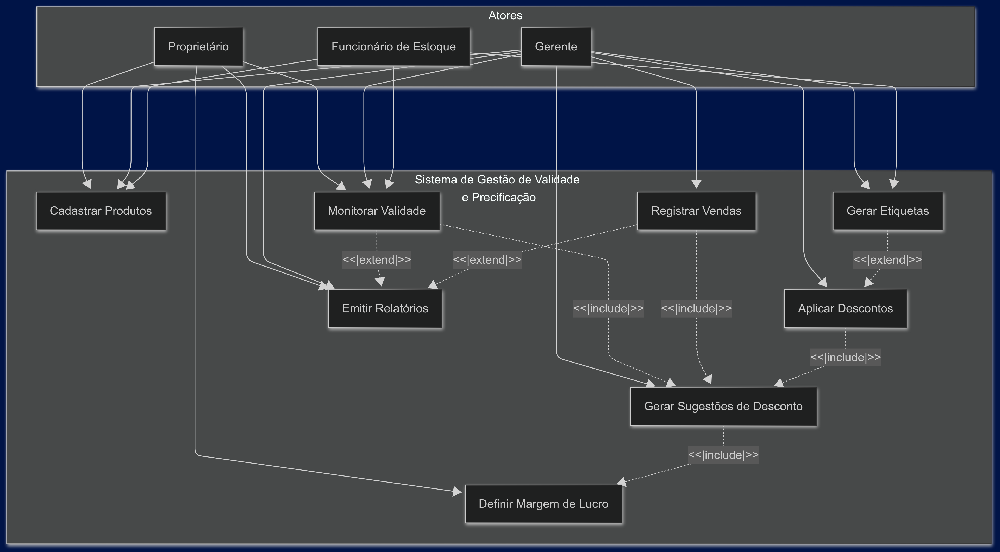

# Especificação do projeto

## Visão Geral

Este documento apresenta a especificação completa para um sistema de gestão de validade e precificação dinâmica destinado a comerciantes varejistas. O sistema visa auxiliar no controle de produtos próximos ao vencimento, aplicando descontos estratégicos com base na data de validade e na taxa de saída dos produtos, minimizando perdas e maximizando lucros.

Para elaborar esta especificação, foram utilizadas as seguintes técnicas e ferramentas:

- Análise de requisitos baseada em transcrições de reuniões de projeto
- Criação de personas representativas do público-alvo
- Elaboração de histórias de usuários
- Definição de requisitos funcionais e não funcionais
- Diagramação de casos de uso

## Personas

### Carlos Silva - Proprietário de Pequeno Mercado de Bairro

**Idade:** 45 anos
**Formação:** Ensino médio completo com curso técnico em administração
**Ocupação:** Dono de um mercado de bairro há 15 anos
**Desafios:** Carlos administra um pequeno mercado que oferece produtos variados. Ele tem dificuldade em controlar o estoque e acaba tendo prejuízo significativo com produtos vencidos ou próximos ao vencimento que precisam ser descartados. Faz contagem manual de estoque e controle de validade em planilhas simples, mas frequentemente não consegue acompanhar todos os itens.
**Necessidades:** Um sistema que o alerte sobre produtos próximos ao vencimento e o ajude a definir estratégias de precificação para minimizar perdas.
**Motivações:** Reduzir prejuízos, melhorar a gestão do negócio e aumentar a lucratividade.

### Mariana Oliveira - Gerente de Padaria

**Idade:** 38 anos
**Formação:** Graduada em Administração
**Ocupação:** Gerente de uma padaria de médio porte com produtos de fabricação própria e revenda
**Desafios:** Mariana precisa gerenciar tanto produtos fabricados internamente quanto itens de revenda. As matérias-primas e produtos industrializados têm diferentes prazos de validade, e ela tem dificuldade em aplicar estratégias eficientes de precificação para produtos próximos ao vencimento.
**Necessidades:** Um sistema que diferencie categorias de produtos, aplique descontos estratégicos considerando a procura por cada item e a proximidade do vencimento.
**Motivações:** Reduzir o desperdício de alimentos, otimizar a gestão de estoque e melhorar a margem de lucro.

### Ricardo Mendes - Proprietário de Hortifruti

**Idade:** 42 anos
**Formação:** Técnico em contabilidade
**Ocupação:** Dono de uma rede de três lojas de hortifruti
**Desafios:** Ricardo lida com produtos altamente perecíveis e com grande variação de demanda. Tem dificuldade em coordenar promoções entre as lojas e acompanhar a validade de produtos em múltiplos pontos de venda.
**Necessidades:** Um sistema centralizado que monitore o estoque de todas as lojas, identifique produtos próximos ao vencimento e sugira transferências entre lojas ou aplicação de descontos personalizados conforme o histórico de vendas de cada unidade.
**Motivações:** Expandir seu negócio mantendo controle eficiente sobre perdas, padronizar a gestão entre as lojas e aumentar a eficiência operacional.

## Histórias de usuários

Com base na análise das personas, foram identificadas as seguintes histórias de usuários:

| EU COMO... `PERSONA`               | QUERO/PRECISO ... `FUNCIONALIDADE`                                                             | PARA ... `MOTIVO/VALOR`                                        |
| ---------------------------------- | ---------------------------------------------------------------------------------------------- | -------------------------------------------------------------- |
| Proprietário de comércio varejista | Cadastrar produtos com suas respectivas datas de validade                                      | Manter controle sobre os prazos de vencimento                  |
| Proprietário de comércio varejista | Visualizar alertas de produtos próximos ao vencimento                                          | Tomar ações preventivas e evitar perdas                        |
| Proprietário de comércio varejista | Definir a margem mínima de lucro aceitável por produto                                         | Garantir que mesmo com descontos o negócio continue lucrativo  |
| Proprietário de comércio varejista | Visualizar histórico de vendas dos produtos                                                    | Identificar quais produtos têm saída mais rápida ou mais lenta |
| Proprietário de comércio varejista | Receber sugestões automáticas de desconto baseadas na data de vencimento e histórico de vendas | Maximizar vendas e minimizar perdas                            |
| Gerente de loja                    | Aplicar descontos em lote para produtos com características similares                          | Agilizar o processo de precificação                            |
| Gerente de loja                    | Gerar etiquetas de preço com destaque para produtos em promoção por vencimento                 | Atrair a atenção dos clientes para produtos em promoção        |
| Gerente de loja                    | Emitir relatórios de produtos vendidos com desconto x produtos perdidos por vencimento         | Avaliar a eficácia da estratégia de descontos                  |
| Funcionário de estoque             | Registrar entrada de produtos com leitura de código de barras                                  | Agilizar o processo de cadastro e minimizar erros              |
| Funcionário de estoque             | Visualizar lista ordenada de produtos por proximidade do vencimento                            | Priorizar a organização de produtos nas gôndolas               |

## Requisitos

As tabelas a seguir apresentam os requisitos funcionais e não funcionais que detalham o escopo do projeto. Para determinar a prioridade dos requisitos, foi utilizada a técnica MoSCoW (Must have, Should have, Could have, Won't have), que categoriza os requisitos conforme sua criticidade para o sucesso do projeto.

### Requisitos funcionais

| ID     | Descrição do Requisito                                                                                                              | Prioridade |
| ------ | ----------------------------------------------------------------------------------------------------------------------------------- | ---------- |
| RF-001 | Permitir o cadastro de produtos com informações de código, nome, preço de custo, preço de venda, margem de lucro e data de validade | MUST       |
| RF-002 | Permitir o registro histórico das vendas por produto                                                                                | MUST       |
| RF-003 | Emitir alertas de produtos próximos ao vencimento                                                                                   | MUST       |
| RF-004 | Calcular automaticamente sugestões de desconto baseadas na proximidade do vencimento e histórico de saída do produto                | MUST       |
| RF-005 | Permitir a definição de margens mínimas de lucro por produto ou categoria                                                           | MUST       |
| RF-006 | Possibilitar a aplicação de descontos em lote para produtos selecionados                                                            | SHOULD     |
| RF-007 | Gerar etiquetas de preço destacando produtos em promoção por vencimento                                                             | SHOULD     |
| RF-008 | Emitir relatórios de produtos vendidos com desconto versus produtos perdidos por vencimento                                         | SHOULD     |
| RF-009 | Permitir o cadastro de múltiplas lojas ou unidades de negócio                                                                       | COULD      |
| RF-010 | Integrar com leitor de código de barras para agilizar o cadastro e baixa de produtos                                                | COULD      |
| RF-011 | Permitir a configuração de regras personalizadas para cálculo automático de descontos                                               | COULD      |
| RF-012 | Exibir gráficos e estatísticas de desempenho de vendas e perdas                                                                     | COULD      |
| RF-013 | Possibilitar a transferência virtual de produtos entre unidades                                                                     | COULD      |
| RF-014 | Integrar com sistema de frente de caixa para atualização automática de estoque                                                      | COULD      |
| RF-015 | Enviar notificações para dispositivos móveis sobre produtos críticos (muito próximos ao vencimento)                                 | COULD      |

### Requisitos não funcionais

| ID      | Descrição do Requisito                                                                                                | Prioridade |
| ------- | --------------------------------------------------------------------------------------------------------------------- | ---------- |
| RNF-001 | O sistema deve ser responsivo para rodar em dispositivos móveis e desktop                                             | MUST       |
| RNF-002 | O sistema deve processar as requisições do usuário em no máximo 3 segundos                                            | SHOULD     |
| RNF-003 | O sistema deve garantir a segurança dos dados do usuário através de autenticação e criptografia                       | MUST       |
| RNF-004 | O sistema deve ser intuitivo e de fácil uso, com interface amigável para usuários com pouca experiência em tecnologia | MUST       |
| RNF-005 | O sistema deve operar mesmo sem conexão à internet, sincronizando dados quando a conexão for reestabelecida           | SHOULD     |
| RNF-006 | Os dados devem ser armazenados em banco de dados seguro e com backup automático diário                                | MUST       |
| RNF-007 | O sistema deve ser capaz de importar dados de planilhas Excel ou CSV                                                  | SHOULD     |
| RNF-008 | O sistema deve estar disponível 99% do tempo (uptime)                                                                 | SHOULD     |
| RNF-009 | O sistema deve ser compatível com impressoras térmicas comuns no mercado                                              | COULD      |
| RNF-010 | O sistema deve permitir integração com outras plataformas via API                                                     | COULD      |

## Restrições

O projeto está restrito aos itens apresentados na tabela a seguir.

| ID  | Restrição                                                                                          |
| --- | -------------------------------------------------------------------------------------------------- |
| 001 | O projeto deverá ser entregue até o final do semestre                                              |
| 002 | O desenvolvimento deve ser realizado com recursos limitados e orçamento predefinido                |
| 003 | O sistema deve funcionar em computadores com configurações modestas e comuns em pequenos comércios |
| 004 | O sistema inicialmente suportará apenas um idioma (português)                                      |
| 005 | A equipe de desenvolvimento é composta por no máximo 5 pessoas                                     |
| 006 | O sistema deve estar em conformidade com a Lei Geral de Proteção de Dados (LGPD)                   |

## Diagrama de casos de uso

O diagrama de casos de uso apresenta as principais funcionalidades do sistema e como os diferentes atores (usuários) interagem com essas funcionalidades.

O diagrama acima ilustra as interações entre os diferentes atores do sistema:

1. **Proprietário**: Tem acesso às funcionalidades administrativas e estratégicas como cadastrar produtos, monitorar validade, definir margens de lucro, emitir relatórios.

2. **Gerente**: Possui acesso operacional mais amplo, incluindo registro de vendas, geração e aplicação de descontos e etiquetas além das funcionalidades compartilhadas com o proprietário.

3. **Funcionário de Estoque**: Tem acesso mais limitado, focado nas atividades de cadastro de produtos, monitoramento de validade e geração de etiquetas.

O fluxo mostra também as relações entre casos de uso, onde o monitoramento de validade leva à geração de sugestões de desconto, que por sua vez leva à aplicação de descontos e finalmente à geração de etiquetas promocionais.
