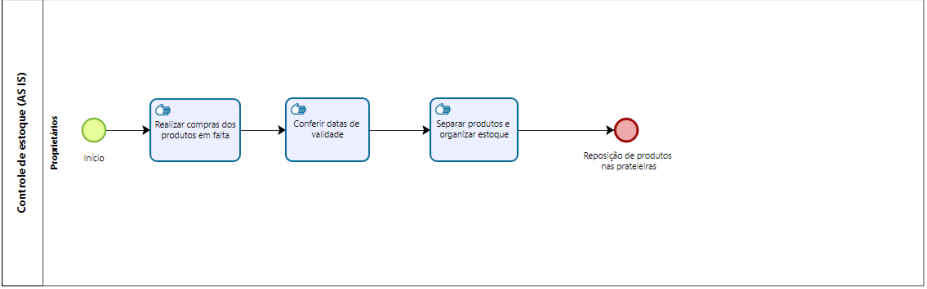
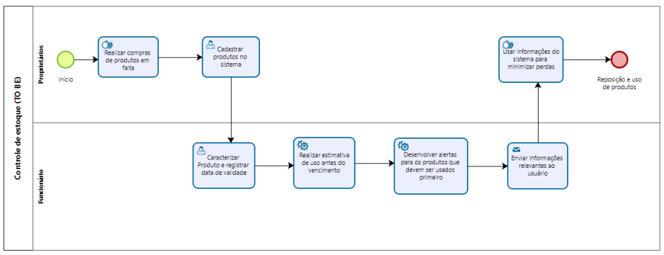

# Modelagem dos processos de negócio

## Modelagem da situação atual (Modelagem AS IS)

Atualmente, o sistema de **Controle de Estoque** realiza o gerenciamento dos produtos de forma manual, com registros em planilhas e processos físicos. As tarefas executadas envolvem a realização de compras dos produtos em falta, conferência manual das datas de validade, organização física do estoque e reposição de produtos nas prateleiras. Essa abordagem tem levado a erros na conferência das datas, atrasos na reposição e perdas de produtos devido ao vencimento, gerando retrabalho e ineficiências operacionais.

Da mesma forma, o processo de **Controle de Precificação** é realizado de forma manual ou semi-automatizada, com riscos de inconsistências na definição dos preços, retrabalhos e dificuldade para ajustar rapidamente as estratégias de preço em função da demanda e da concorrência.

Cole os modelos dos processos atuais (modelo AS IS) elaborados com a ferramenta BPMN nos espaços indicados abaixo:

- **Controle de Estoque (AS IS):**
  

- **Controle de Precificação (AS IS):**
  

---

## Descrição geral da proposta (Modelagem TO BE)

Visando superar os gargalos identificados no cenário atual, a proposta de solução introduz a automação e o registro sistemático das operações. A ideia é substituir os processos manuais por sistemas informatizados que:

- Automatizem o registro dos produtos e suas datas de validade, calculando estimativas de uso e gerando alertas automáticos para priorizar produtos com vencimento próximo;
- Atualizem automaticamente os preços dos produtos com base em algoritmos de precificação, considerando dados históricos, demanda e concorrência;
- Enviem notificações para os responsáveis, facilitando a tomada de decisão quanto à reposição de estoque e ajustes de preços.

A solução TO BE está alinhada com os objetivos estratégicos de aumentar a eficiência operacional, reduzir perdas e melhorar o controle sobre o estoque e a precificação. No entanto, a proposta também considera os limites da integração com sistemas legados e a necessidade de treinamento dos usuários para a adoção do novo sistema.

Cole os modelos da solução proposta (modelo TO BE) elaborados com a ferramenta BPMN nos espaços indicados abaixo:

- **Controle de Estoque (TO BE):**
  

- **Controle de Precificação (TO BE):**
  

---

## Modelagem dos processos

- [PROCESSO 1 - Controle de Estoque](./processes/processo-1-controle-de-estoque.md "Detalhamento do processo 1.")
- [PROCESSO 2 - Controle de Precificação](./processes/processo-2-controle-de-precificacao.md "Detalhamento do processo 2.")

---

## Indicadores de desempenho

A seguir, são apresentados os principais indicadores de desempenho para monitorar a eficiência dos processos e identificar oportunidades de melhoria:

| **Indicador**                 | **Objetivos**                                                                   | **Descrição**                                                                 | **Fonte de dados**     | **Fórmula de cálculo**                                                   |
| ----------------------------- | ------------------------------------------------------------------------------- | ----------------------------------------------------------------------------- | ---------------------- | ------------------------------------------------------------------------ |
| Percentual de reclamações     | Avaliar quantitativamente as reclamações                                        | Percentual de reclamações em relação ao total de atendimentos                 | Tabela Reclamações     | (Número total de reclamações / Número total de atendimentos) × 100       |
| Taxa de requisições atendidas | Melhorar a prestação de serviços medindo a porcentagem de requisições atendidas | Mede a porcentagem de requisições atendidas semanalmente                      | Tabela Solicitações    | (Número de requisições atendidas / Número total de requisições) × 100    |
| Taxa de entrega de material   | Manter controle sobre os materiais que estão sendo entregues                    | Mede a porcentagem de material entregue dentro do mês                         | Tabela Pedidos         | (Número de pedidos entregues / Número total de pedidos) × 100            |
| Tempo médio de atendimento    | Avaliar a eficiência do processo de atendimento                                 | Tempo médio gasto para concluir um atendimento                                | Logs de Atendimento    | Soma dos tempos de atendimento / Número total de atendimentos            |
| Eficiência do processo        | Medir a eficácia global do processo                                             | Relação entre as atividades concluídas sem retrabalho e o total de atividades | Registros de processos | (Número de atividades sem retrabalho / Número total de atividades) × 100 |
