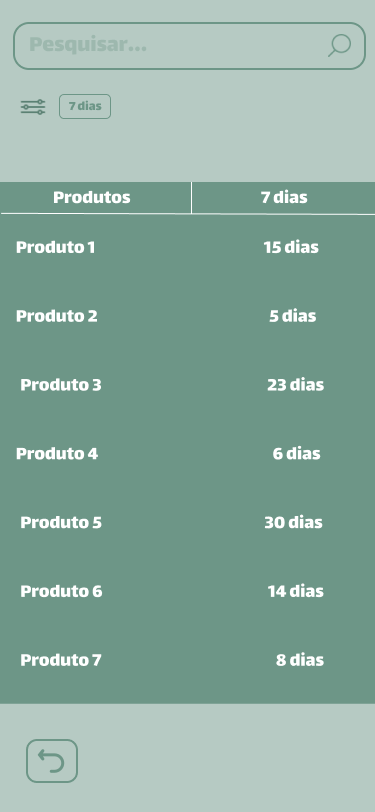

# Projeto de interface

Pré-requisitos: <a href="02-Especificacao.md"> Especificação do projeto</a>

Visão geral da interação do usuário pelas telas do sistema e protótipo interativo das telas com as funcionalidades que fazem parte do sistema (wireframes).
<a href="02-Especificacao.md"> Especificação do projeto</a>.

 ## User flow

### Diagrama de fluxo

## Interface do sistema/Wireframes

A partir da definição dos requisitos funcionais do projeto, evidencia-se  algumas funções principais que o sistema deve incorporar, como a leitura de um código de barras sendo o núcleo de toda a aplicação e a partir disso, o cadastro de um produto, listagem de produtos, leitura de dados de um produto específico e alteração cadastral do mesmo. Também faz-se importante a implementação de um algoritmo para recomendação de venda de produtos a partir de duas variáveis: seu custo e data de vencimento. Assim, estrutura-se o software pelas entidades que o compõe, casos de uso para relacioná-las, persistência de dados em um banco relacional e a prototipagem de mocks visando a navegabilidade usual dos usuários finais.

### Home

Aqui são apresentados os principais fluxos para o usuário decidir qual seguir.

### Recomendações

Os produtos que contém uma relação entre custo e data de validade são atrelados a preços de vendas sugerido

### Cadastro de Produtos

O sistema acessa a câmera do celular do usuário para fazer a leitura do código de barras do produto.

### Confirmação de Cadastro

O o usuário obtém as informações do produto e confirma seu cadastro.

### Listagem de Produtos

Seguindo para o próximo possível fluxo, aqui o usuário tem a listagem de todos os produtos cadastrados, podendo filtrá-los por dias próximos a validade.

### Visualização de Produtos

O usuário após selecionar um produto na tela de listagem, pode ver seus detalhes cadastrados, além de também, poder selecionar a opção de edição.

### Edição de Produtos

O usuário após selecionar um produto na tela de listagem, pode ver seus detalhes cadastrados, além de também, poder selecionar a opção de edição.