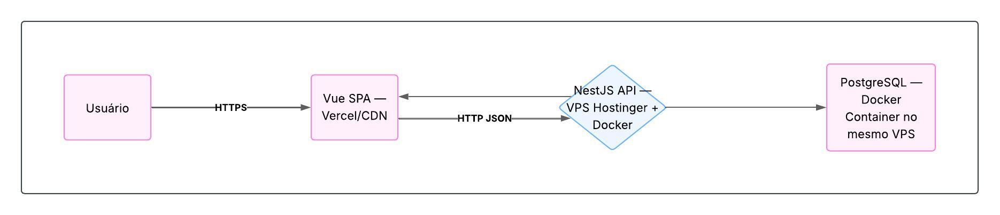
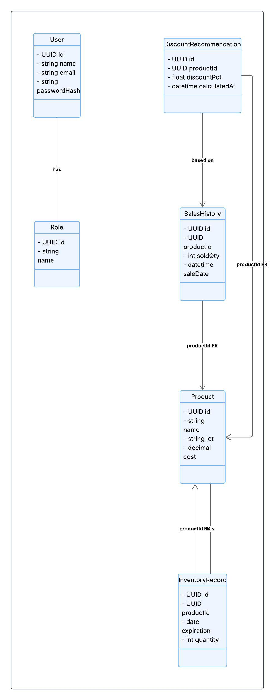

# Arquitetura da solução

<span style="color:red">Pré-requisitos: <a href="05-Projeto-interface.md"> Projeto de interface</a></span>

## 1. Visão de containers (deployment)



Front‑end (Vue.js + SASS + Shadcn/Mantine)
– Empacotado como SPA e hospedado no Vercel, servido via CDN.

Back‑end (NestJS + TypeScript)
– Deploy em VPS (Hostinger) dentro de container Docker; expõe APIs REST/JSON.
– DNS gerenciado pela Cloudflare apontando o domínio para o VPS.

Banco de Dados (PostgreSQL + TypeORM)
– Container Docker orquestrado pelo mesmo host; persiste dados relacionais.

## Diagrama de classes



User↔Role: cada usuário pode ter vários papéis, controlando acesso.

Product: entidade central, ligada aos registros de estoque (InventoryRecord) e histórico de vendas (SalesHistory), que alimentam a lógica de desconto (DiscountRecommendation).

##  Modelo de dados

> Entidades e Relacionamentos (DER)
- USER (id, name, email, password_hash)

- ROLE (id, name)

- USER_ROLE (user_id FK → USER.id, role_id FK → ROLE.id)

- PRODUCT (id, name, lot, cost)

- INVENTORY_RECORD (id, product_id FK → PRODUCT.id, expiration_date, quantity)

- SALES_HISTORY (id, product_id FK → PRODUCT.id, sale_date, sold_quantity)

- DISCOUNT_RECOMMENDATION (id, product_id FK → PRODUCT.id, discount_pct, calculated_at).

```sql
CREATE TABLE "USER" (
  id UUID PRIMARY KEY,
  name VARCHAR(100) NOT NULL,
  email VARCHAR(150) UNIQUE NOT NULL,
  password_hash VARCHAR(256) NOT NULL
);

CREATE TABLE "ROLE" (
  id UUID PRIMARY KEY,
  name VARCHAR(50) UNIQUE NOT NULL
);

CREATE TABLE "USER_ROLE" (
  user_id UUID REFERENCES "USER"(id),
  role_id UUID REFERENCES "ROLE"(id),
  PRIMARY KEY (user_id, role_id)
);

CREATE TABLE "PRODUCT" (
  id UUID PRIMARY KEY,
  name VARCHAR(150) NOT NULL,
  lot VARCHAR(50),
  cost NUMERIC(10,2) NOT NULL
);

CREATE TABLE "INVENTORY_RECORD" (
  id UUID PRIMARY KEY,
  product_id UUID REFERENCES "PRODUCT"(id),
  expiration_date DATE NOT NULL,
  quantity INT NOT NULL
);

CREATE TABLE "SALES_HISTORY" (
  id UUID PRIMARY KEY,
  product_id UUID REFERENCES "PRODUCT"(id),
  sale_date TIMESTAMP NOT NULL,
  sold_quantity INT NOT NULL
);

CREATE TABLE "DISCOUNT_RECOMMENDATION" (
  id UUID PRIMARY KEY,
  product_id UUID REFERENCES "PRODUCT"(id),
  discount_pct REAL NOT NULL,
  calculated_at TIMESTAMP NOT NULL
);

```

## Fluxo de Interação do Usuário

Cliente carrega o SPA do Vercel.

Ao acessar “Cadastro de Produto” → Front‑end envia POST /products → API NestJS grava em PostgreSQL.

Em “Recomendações”, o Front‑end GET /recommendations → API calcula a partir de SALES_HISTORY + INVENTORY_RECORD e persiste em DISCOUNT_RECOMMENDATION.

Resposta JSON retorna à UI e exibe cards/dashboards.

## Tecnologias & Ferramentas

Linguagens: TypeScript (front + back), SQL (modelagem)

Front‑end: React.js, SASS, Shadcn/UI, Mantine

Back‑end: Node.js, NestJS, TypeORM

Banco: PostgreSQL

Containers: Docker

Hospedagem: Vercel (front), Hostinger+Cloudflare (back + DB)

Testes: Jest (unit), Selenium (E2E), Postman (API)

CI/CD: GitHub Actions (pipeline build → test → deploy)

## Qualidade de Software (ISO/IEC 25010)

| Característica    | Subcaracterística            | Justificativa                                                                 | Métrica                                           |
|-------------------|------------------------------|-------------------------------------------------------------------------------|---------------------------------------------------|
| Funcionalidade    | FunctionalSuitability        | Garante que cada requisito (cadastro, recomendação, dashboards) esteja correto. | % de casos de teste aprovados (alvo ≥ 95 %)       |
| Usabilidade       | Operability                  | A interface deve ser intuitiva para operadores de padaria.                    | SUS (System Usability Scale) ≥ 80                 |
| Confiabilidade    | Availability                 | Sistema deve estar online quando necessário.                                  | Uptime mensal ≥ 99,5 %                            |
| Desempenho        | TimeBehavior                 | Respostas às APIs devem ser rápidas para não impactar o fluxo de trabalho.     | Latência média de API ≤ 200 ms                    |
| Manutenibilidade  | Modularity                   | Código organizado em módulos facilita evolução e correções.                   | Cobertura de testes unitários ≥ 80 %; Complexidade ciclomática média ≤ 10 |

