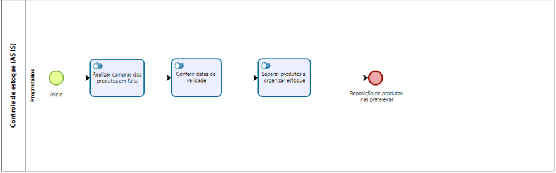
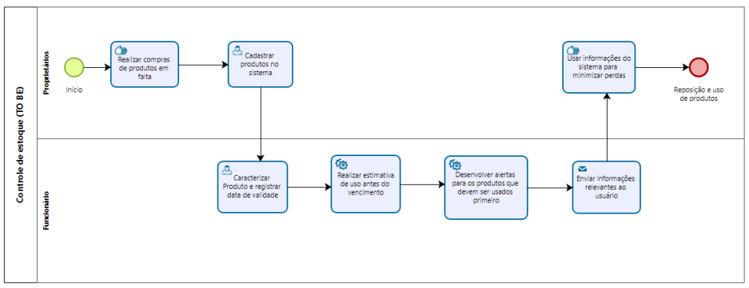

# 3.3.1 Processo 1 – Controle de Estoque

Este documento apresenta o processo de **Controle de Estoque** no cenário atual (**AS IS**) e a proposta de melhoria (**TO BE**). Em cada etapa, são descritas as atividades, os campos e comandos que compõem o fluxo do processo.

---

## Oportunidades de Melhoria

- **Falta de registro sistemático** dos produtos comprados.
- **Conferência manual** das datas de validade, suscetível a erros e esquecimentos.
- **Ausência de alertas** para vencimento e priorização de uso dos produtos.
- **Risco de perdas** por produtos vencidos ou não utilizados a tempo.

As melhorias propostas visam:

- **Registro automatizado** dos produtos e suas datas de validade.
- **Estimativas de uso** com base em histórico e demanda.
- **Alertas automáticos** para uso prioritário de produtos próximos ao vencimento.
- **Envio de informações relevantes** ao usuário, reduzindo perdas e otimizando a reposição.

---

## 3.3.1.1 Processo 1 – AS IS

### Modelo BPMN do Processo AS IS

No cenário atual (AS IS), o processo segue as seguintes atividades:

1. **Realizar compras dos produtos em falta**
2. **Conferir datas de validade**
3. **Separar produtos e organizar estoque**
4. **Reposição de produtos nas prateleiras**

### Detalhamento das atividades – AS IS

#### Atividade 1: Realizar compras dos produtos em falta

| **Campo**         | **Tipo**         | **Restrições**  | **Valor default** |
| ----------------- | ---------------- | --------------- | ----------------- |
| Lista de produtos | Seleção múltipla | Obrigatório     |                   |
| Fornecedor        | Seleção única    | Obrigatório     |                   |
| Quantidade        | Número           | Valor mínimo: 1 |                   |
| Data da compra    | Data             | Obrigatório     | Data atual        |

| **Comandos**     | **Destino**                | **Tipo** |
| ---------------- | -------------------------- | -------- |
| confirmar compra | Conferir datas de validade | default  |
| cancelar         | Fim do Processo            | cancel   |

---

#### Atividade 2: Conferir datas de validade

| **Campo**        | **Tipo**       | **Restrições** | **Valor default** |
| ---------------- | -------------- | -------------- | ----------------- |
| Produto          | Caixa de texto | Obrigatório    |                   |
| Data de validade | Data           | Obrigatório    |                   |

| **Comandos** | **Destino**                          | **Tipo** |
| ------------ | ------------------------------------ | -------- |
| salvar       | Separar produtos e organizar estoque | default  |

---

#### Atividade 3: Separar produtos e organizar estoque

| **Campo**              | **Tipo**      | **Restrições** | **Valor default** |
| ---------------------- | ------------- | -------------- | ----------------- |
| Local de armazenamento | Seleção única | Obrigatório    |                   |
| Quantidade em estoque  | Número        | Obrigatório    |                   |

| **Comandos**         | **Destino**                           | **Tipo** |
| -------------------- | ------------------------------------- | -------- |
| concluir organização | Reposição de produtos nas prateleiras | default  |

---

#### Atividade 4: Reposição de produtos nas prateleiras

- **Atividade de encerramento** do processo.
- Produtos são organizados fisicamente nas prateleiras conforme as prioridades identificadas.

---

## 3.3.1.2 Processo 1 – TO BE

### Modelo BPMN do Processo TO BE

A proposta de melhoria (TO BE) para o processo inclui:

1. **Realizar compras de produtos em falta**
2. **Cadastrar produtos no sistema**
3. **Caracterizar produto e registrar data de validade**
4. **Realizar estimativa de uso antes do vencimento**
5. **Desenvolver alertas para produtos que devem ser usados primeiro**
6. **Enviar informações relevantes ao usuário**
7. **Reposição de produtos**

### Detalhamento das atividades – TO BE

#### Atividade 1: Realizar compras dos produtos em falta

| **Campo**         | **Tipo**         | **Restrições**  | **Valor default** |
| ----------------- | ---------------- | --------------- | ----------------- |
| Lista de produtos | Seleção múltipla | Obrigatório     |                   |
| Fornecedor        | Seleção única    | Obrigatório     |                   |
| Quantidade        | Número           | Valor mínimo: 1 |                   |
| Data da compra    | Data             | Obrigatório     | Data atual        |

| **Comandos**     | **Destino**                   | **Tipo** |
| ---------------- | ----------------------------- | -------- |
| confirmar compra | Cadastrar produtos no sistema | default  |
| cancelar         | Fim do Processo               | cancel   |

---

#### Atividade 2: Cadastrar produtos no sistema

| **Campo**           | **Tipo**       | **Restrições**         | **Valor default** |
| ------------------- | -------------- | ---------------------- | ----------------- |
| Nome do produto     | Caixa de texto | Obrigatório            |                   |
| Categoria           | Seleção única  | Obrigatório            |                   |
| Quantidade recebida | Número         | Obrigatório, mínimo: 1 |                   |
| Data de entrada     | Data           | Obrigatório            | Data atual        |

| **Comandos** | **Destino**          | **Tipo** |
| ------------ | -------------------- | -------- |
| salvar       | Caracterizar produto | default  |

---

#### Atividade 3: Caracterizar produto e registrar data de validade

| **Campo**                  | **Tipo**      | **Restrições** | **Valor default** |
| -------------------------- | ------------- | -------------- | ----------------- |
| Data de validade           | Data          | Obrigatório    |                   |
| Condições de armazenamento | Área de texto | Opcional       |                   |

| **Comandos** | **Destino**                | **Tipo** |
| ------------ | -------------------------- | -------- |
| salvar       | Realizar estimativa de uso | default  |

---

#### Atividade 4: Realizar estimativa de uso antes do vencimento

| **Campo**             | **Tipo** | **Restrições** | **Valor default** |
| --------------------- | -------- | -------------- | ----------------- |
| Consumo médio mensal  | Número   | Obrigatório    |                   |
| Estimativa de consumo | Número   | Calculado      |                   |

| **Comandos**     | **Destino**         | **Tipo** |
| ---------------- | ------------------- | -------- |
| gerar estimativa | Desenvolver alertas | default  |

---

#### Atividade 5: Desenvolver alertas para produtos que devem ser usados primeiro

| **Campo**          | **Tipo** | **Restrições**  | **Valor default** |
| ------------------ | -------- | --------------- | ----------------- |
| Produtos em alerta | Tabela   | Somente leitura |                   |

| **Comandos**   | **Destino**                   | **Tipo** |
| -------------- | ----------------------------- | -------- |
| enviar alertas | Enviar informações ao usuário | default  |

---

#### Atividade 6: Enviar informações relevantes ao usuário

| **Campo**              | **Tipo**      | **Restrições**  | **Valor default** |
| ---------------------- | ------------- | --------------- | ----------------- |
| Informações do produto | Tabela        | Somente leitura |                   |
| Notificações           | Área de texto | Opcional        |                   |

| **Comandos**      | **Destino**           | **Tipo** |
| ----------------- | --------------------- | -------- |
| notificar usuário | Reposição de produtos | default  |

---

#### Atividade 7: Reposição de produtos

- **Atividade de encerramento** do processo.
- Após as informações serem enviadas, realiza-se a reposição física dos produtos nas prateleiras, priorizando aqueles com vencimento mais próximo.

---

**Fim do Documento**
